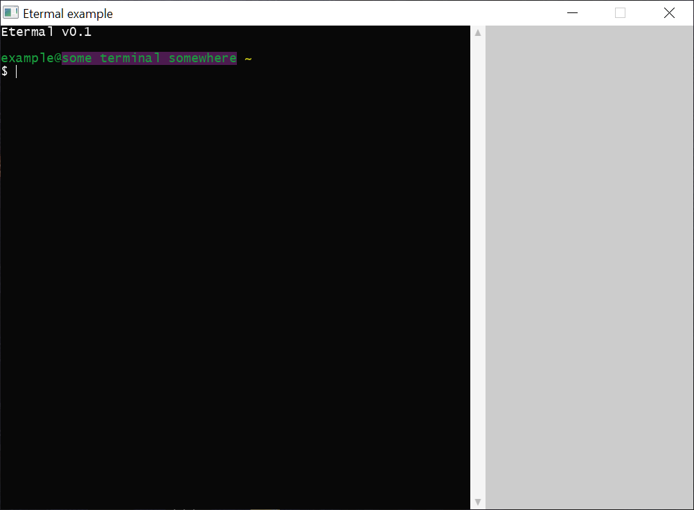

# Etermal

## What is it?

A minimal-footprint terminal for OpenGL 3.3.

## Features

- Easy setup (see [docs](https://keinr.github.io/Etermal/docs/index.html))
- Extensible interfaces that allow for user-defined shell and terminal implementations.
- Tested with Visual Studio 2019 and g++ (GCC) 9.3.0 (as of version `2.0.0`)
- Terminal frontend
    - Polymorphic
        - There's only one implementation
    - Polymorphic fonts
        - Bitmap font support
        - Vector font support (uses Freetype)
    - Colored text (full RGB support!)
    - UTF-8 support
    - Scrolling
    - Dynamic initialization of OpenGL resources
    - User input
    - Input area control (clear/set)
    - Caller OpenGL state preserved when rendering
    - No-throw policy; Font and BmpFont are the only classes that throw exceptions, and only `<stdexcept>` members from their contructors (this is not the case for shell-related classes).
- Shell backend
    - Polymophic
        - Shell with advanced type-based argument parser
        - Basic shell that simply breaks up arguments into a vector

## Documentation

Hosted [here](https://keinr.github.io/Etermal/docs/index.html), but you can also generate it during the build process yourself. Also, as of `2.0.0`, docs are included in every release.

## Contributing

Welcome, as always. See `CONTRIBUTING`.

## Disclaimer

*Etermal uses `Freetype` for font rendering, which is copyright © 2006 The FreeType Project (www.freetype.org). All rights reserved.*
